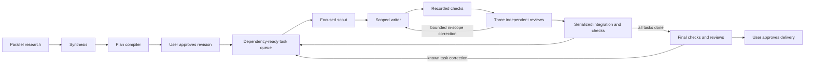

# Hybrid complex-work controller

Complex work combines deterministic execution with autonomous judgment. The user approves scope and operating limits. The controller chooses when an agent can run and verifies what happened. Agents choose how to solve their assigned problems.

## Normal use

1. Run `/complex-work <request>`. Four read-only scouts inspect architecture, validation, contracts, and risks in a private snapshot. Synthesis and planning follow automatically.
2. If research identifies actual user decisions, answer them with `/complex-work-decide ["first answer", "second answer"]`, in displayed order.
3. Read the plan, acceptance criteria, resource claims, and commands. Run `/complex-work-go <revision>` for the displayed revision.
4. Implementation, checks, independent reviews, bounded corrections, and integration continue automatically. A blocked task prevents its dependents from starting; unrelated branches continue.
5. Inspect the final review checkout shown by `/complex-work-status`. After final checks and three independent reviews pass, `/complex-work-verify <revision>` applies the reviewed patch to the original checkout.

Approvals are user commands. The model-facing `complex_work_control` tool is read-only and cannot approve, skip checks, finish, or cancel work. Root mutation/delegation tools are blocked while a mission is active so it cannot create a competing workflow.

## User controls

| Command | Behavior |
| --- | --- |
| `/complex-work-status` | Task stages, active/uncertain operations, budgets, evidence paths, recent history |
| `/complex-work-pause` | Stop new admissions; current jobs finish |
| `/complex-work-resume` | Resume scheduling under existing approval |
| `/complex-work-steer <message>` | Queue guidance to live agents and retain it for future tasks; scope does not expand |
| `/complex-work-policy <JSON object>` | Change explicit operating limits while idle, or after paused work drains |
| `/complex-work-approve-task <task-id>` | Approve integration when task checkpoints are enabled |
| `/complex-work-retry [task-id]` | Renew bounded attempts for an idle failed task or discovery/final gate |
| `/complex-work-replan [decision or change]` | Propose a replacement graph from the current integrated result; requires no active jobs and fresh approval |
| `/complex-work-cancel` | Stop active work and retain snapshots, patches and evidence |

A task blocked on a scope or authority decision requires a replacement plan. Retrying it does not silently authorize new scope. Pause before replanning so new work cannot race the change.

Defaults:

```json
{
  "maxAgents": 4,
  "maxChecks": 2,
  "maxRepairs": 2,
  "maxAttempts": 3,
  "maxLaunches": 128,
  "runTimeoutMs": 3600000,
  "checkpoints": "final"
}
```

`maxAgents` counts leaf agents, including scouts and reviewers; there are no hidden nested coordinators. `maxChecks` counts controller validation/integration jobs; each runs its commands serially. A writer can also run its own approved checks within its agent slot. Pi-subagents' own configured limits still apply. `maxLaunches` is a cumulative mission limit. A user can renew a task retry budget explicitly. `checkpoints: "task"` adds a user gate before each task's integration. `PI_SOUND_DISABLED=1` disables attention bells.

## Execution architecture



The graph is task-based. `dependsOn` is the only executable dependency field, and the compiler rejects cycles and unknown references. Directory claims overlap their descendants; file and named-contract claims distinguish reads from writes. Scheduling prioritizes tasks that unlock longer dependency chains. Each completion refills available slots; an unrelated slow task does not create a batch barrier.

Each task has one writable checkout. The controller runs scout then writer directly. Runtime-registered `complex-work-scout`, `complex-work-synthesis`, `complex-work-planner`, `complex-work-writer`, and `complex-work-reviewer` roles have fixed tool lists and child-only guards. Read-only roles receive read/search tools. Writers receive scoped edit/write/delete and `complex_work_check`, which selects an approved argv command by ID. No role receives `bash` or `subagent`.

The tool boundary validates write paths before execution and rejects symlink traversal. Patch inspection checks every changed path, including new/deleted files. These are tool and artifact boundaries, not an operating-system sandbox: approved checks execute project code and may have side effects. Review the plan's actual commands. The workflow does not silently install dependencies; a private checkout must establish them through approved commands if needed.

## Snapshots and evidence

A mission has a private integration repository and per-task repositories under `$XDG_STATE_HOME/pi/complex-work/<mission-id>/` (default `~/.local/state/pi/complex-work/`). Storage must be outside the source repository, including when `~/.pi` is symlinked into it. Snapshotting captures the original working files, including staged/unstaged and nonignored untracked changes, through a private index. It does not commit, stash, reset, or stage the user's checkout. Git submodules are currently unsupported and fail explicitly.

Private commits identify exact input, checked candidate, and integration revisions. The controller applies a reviewed candidate into a separate integration candidate, runs the task checks, and advances the private integration reference only after success. Integration checks that change reviewed source are rejected. Dependent tasks start from the resulting clean checkpoint.

Validation records command argv, cwd, timestamps, exit code, timeout state and bounded stdout/stderr. A detached check supervisor writes durable results and owns timeout/cancellation; restarting the UI does not repeat a command that already produced evidence. Task records in `docs/tasks/complex-<mission>-r<revision>-<task>.md` are generated by the controller and report implementation, validation and review state.

Each review covers the assigned criterion IDs and inspects source plus the exact diff and recorded evidence. Contradictory pass/block reports fail validation. Known in-scope corrections return to the writer within its repair budget. Final reviewers can route a correction to an existing `taskId`; that task and its dependents receive fresh checks and reviews. A new scope decision returns to the user.

Delivery compares affected source files to the captured input before applying the patch. Concurrent edits to affected files cause a refusal; unrelated edits are preserved. The original branch and index remain unchanged. Repeating delivery of the identical already-applied result is harmless. The patch remains at `delivery.patch` in the mission directory.

## Persistence and recovery

`state.json` is authoritative; Pi session entries contain ownership/display pointers. Commands and completions are serialized through one controller queue. A launch reservation is persisted before RPC. Duplicate completion events are ignored after the operation is consumed. Revision-bound approval prevents old approval from authorizing a changed graph.

On startup and periodically, runtime status and child receipts reconcile missing completions. An acknowledgement timeout is uncertain, not proof of failure: its slot stays reserved until the original run is identified. No blind duplicate is launched. Private local operations and check receipts support replay after a controller restart. Cancellation is distinct from completion and late completions cannot advance a cancelled mission.

Version-1 wave missions are not resumed under the new graph protocol. If a legacy active run is recorded, cancel it before starting a new mission. Artifacts are retained for inspection; there is no automatic destructive cleanup.

## Verification

From `pi/agent`:

```sh
node --test --test-isolation=none tests/*.test.mjs
tsc --noEmit --skipLibCheck --target es2023 --module nodenext --moduleResolution nodenext --allowImportingTsExtensions --strict extensions/complex-work.ts lib/complex-work/*.ts lib/complex-work-contracts.ts
```

The tests cover controller event paths, command authorization, task dependencies, role/path boundaries, actual Git snapshots/integration/delivery, and real command evidence. They use deterministic model responses; they do not assert live model quality or provider availability.
