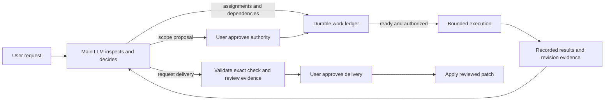

# Model-directed work with durable bookkeeping

The main LLM decides what work is useful, defines agents, and chooses dependencies. The controller records execution and enforces authority. It has no research, synthesis, writing, or reviewing phase sequence.

## Normal use

1. Run `/complex-work <request>`. A private snapshot is created. The main LLM inspects the request and source; no child agents start automatically.
2. The LLM may submit read-only assignments immediately. When changes are needed, it proposes scope: objectives, acceptance criteria, resource boundaries and approved commands.
3. Inspect the scope and policy, then use `/complex-work-go <revision>` to authorize changes. A scope proposal does not define an agent roster or execution order.
4. The LLM submits work individually or as a dependency graph. The controller runs ready operations within limits. Results wake the LLM, which can inspect evidence and decide what to do next. Previously submitted dependent work can continue without another model turn.
5. The LLM requests delivery using passing evidence for the current integrated revision. Inspect the private checkout, then use `/complex-work-verify <revision>` to apply the reviewed patch.



This is a feedback loop, not a mandatory sequence of agents.

The model-facing guidance lives in `pi/agent/prompts/complex-work.md`. It presents **understand → investigate → plan authority → act → validate → review → deliver** as a recurring checklist. The coordinator may skip, repeat, parallelize, or revisit any activity; the checklist has no representation in persisted state and cannot trigger work.

## State that is retained

- **Work:** immutable definitions and dependencies, pending/running/uncertain/completed/failed/cancelled status, runtime identity, inputs, results and errors.
- **Authority:** scope revision, approval digest, writable resources, exact command argv, concurrency and cumulative budgets.
- **Evidence:** immutable Git candidates and patch bases, command results, independent review coverage, integration heads and delivery approval.

A failed item remains failed. There is no automatic retry, writer repair loop, or replacement reviewer. The LLM can submit a new operation with a new ID. An uncertain launch retains its slot until its identity and terminal state are known; it is never blindly relaunched.

The mission itself has only active/completed/cancelled status, a scheduling pause, and explicit approval/decision records.

## Model tools

| Tool | Purpose |
| --- | --- |
| `complex_work_control` | Show scope, work status and evidence locations; supply a work ID to retrieve its full assignment/result |
| `complex_work_scope` | Propose scope for user approval; supersede pending work and invalidate the previous approval |
| `complex_work_submit` | Append operations and dependencies; does not grant authority |
| `complex_work_cancel_work` | Cancel unnecessary pending work or request termination of running operations |
| `complex_work_decision` | Record unresolved user scope/product questions; further scheduling waits for answers |
| `complex_work_delivery` | Present final evidence for user delivery approval |
| `complex_work_withdraw_delivery` | Release a pending/failed delivery reservation to allow corrections |

Root read/search tools remain available. Root shell, mutation and direct delegation are blocked during an active mission so mutations and child lifetimes are recorded through the ledger.

## Work definitions

Each operation has a unique `id` and explicit `dependsOn` list. IDs cannot be overwritten or reused. The controller validates an entire batch before admitting any of it, rejecting cycles, missing references and unauthorized task IDs.

Operations represent capabilities, not agent personas:

| Operation | Meaning |
| --- | --- |
| `agent`, `access: read` | Model-defined read-only assignment; available before scope approval |
| `agent`, `access: write` | Model-defined assignment inside an approved task's resource boundaries |
| `review` | Independent model-defined assignment producing structured findings about an exact input candidate |
| `check` | Run approved task checks, or final checks when `taskId` is absent |
| `integrate` | Apply an explicitly named task candidate after validating its supplied check/review evidence |

Agent assignments contain `id`, `name`, `instructions`, and optional `model`. Each agent gets a fresh runtime identity and private checkout. There are no predefined specialists, prescribed counts, or mandatory scouting steps. Read-only agents get read/search tools; write agents additionally get scoped edit/write/delete and approved checks. Children cannot delegate or run arbitrary shell commands.

An optional `input` names a work result's immutable snapshot. Without an input, an eligible operation captures the current integration head at dispatch. Input and integration evidence references must also be direct dependencies. Dependency outputs are included in agent prompts.

Dependencies normally require completed work. To inspect or correct a failed result, the LLM must explicitly list that dependency in `allowFailed`. This does not treat failure as passing evidence. Cancelled or uncertain dependencies do not satisfy readiness; dependents stay pending until explicitly cancelled or replaced.

For example, a model may queue independent investigation, then choose a change, then request a second investigation before deciding which checks and reviews matter. It may also queue checks and review in parallel against an already captured candidate. None of those paths is manufactured by the controller.

## Evidence and delivery

Write results are checkpointed and their entire patch is checked against approved resource boundaries. Checks and reviews run in separate snapshots of the selected revision. A check that changes tracked source cannot certify the original candidate.

Integration requires successful approved checks and independent passing reviews for the same candidate, task and scope revision. The selected reviews must collectively cover all required acceptance criteria. Selecting a favorable report cannot hide another unresolved blocking review of that candidate. Failed command evidence can be superseded by a passing check that explicitly acknowledges the failed check through an `allowFailed` dependency.

Integration is serialized. The patch is applied in a private integration candidate and the task's commands run again before the integration head advances. Further corrections to an integrated task must start from a revision containing its previous integration.

The LLM chooses when to collect final evidence and request delivery. All approved tasks must be integrated; no pending, running or uncertain work may remain. Final checks and review coverage must match the current integrated head and scope revision. Delivery reserves that exact revision until the user approves or the request is withdrawn.

Delivery compares affected source files to the original snapshot, refusing concurrent conflicting edits. Unrelated edits, the user's branch and index are preserved. Delivery is idempotent if interrupted after the same patch was applied.

## User controls and limits

| Command | Purpose |
| --- | --- |
| `/complex-work-status` | Work, dependencies, approvals, decisions and evidence |
| `/complex-work-go <revision>` | Approve displayed scope and policy |
| `/complex-work-pause` / `resume` | Pause new admissions or resume queued work |
| `/complex-work-policy <JSON>` | Change limits while operations are idle |
| `/complex-work-decide <JSON array>` | Answer each pending question in order |
| `/complex-work-approve-task <work-id>` | Approve a pending integration when integration checkpoints are enabled |
| `/complex-work-steer <guidance>` | Notify running agents and the main LLM; does not expand authority |
| `/complex-work-retry [work-id]` | Ask the LLM to assess failed work and choose a response |
| `/complex-work-replan [guidance]` | Ask the LLM to reassess scope or work; no fixed sequence is restarted |
| `/complex-work-verify <revision>` | Approve the requested delivery |
| `/complex-work-withdraw-delivery` | Release a pending or failed delivery reservation |
| `/complex-work-cancel` | Cancel the mission and retain artifacts |

Defaults are 4 concurrent agents, 2 concurrent local operations, 128 cumulative agent launches, 512 cumulative work items and a one-hour agent timeout. `checkpoints: "final"` permits integration inside approved scope; `"task"` additionally requires approval of each integration work ID. There are no per-role retry counts. `PI_SOUND_DISABLED=1` disables notification bells.

## Persistence and recovery

State is stored under `$XDG_STATE_HOME/pi/complex-work/<mission-id>/` (default `~/.local/state/pi/complex-work/`). Git snapshots, receipts, check evidence and runtime IDs survive restarts. Session entries contain ownership pointers, not the authoritative ledger.

Reservations and selected input revisions are persisted before effects. Duplicate completions cannot overwrite terminal work. Missing completions are reconciled through runtime status and correlated receipts. Missing launch identity is treated as uncertain. A process lease prevents two controllers from scheduling one mission.

Detached check supervisors retain command outcomes so controller recovery can observe them without repeating the command. Local integration and delivery effects preserve their replay evidence. These boundaries are not an OS sandbox: approved commands execute project code and may have side effects. Dependency setup must be included explicitly when private snapshots need it.

Version-2 phase-based missions are retained as paused legacy evidence, with no conversion into new work assignments. Existing operations can be inspected or stopped, but no old agents or stages are recreated. Cancel the old mission before starting a version-3 mission.

## Verification

From `pi/agent`:

```sh
node --test --test-isolation=none tests/*.test.mjs
tsc --noEmit --skipLibCheck --target es2023 --module nodenext --moduleResolution nodenext --allowImportingTsExtensions --strict extensions/complex-work.ts lib/complex-work/*.ts lib/complex-work-contracts.ts
```

Tests exercise arbitrary model-defined sequences, authorization, dependencies, failure handling, recovery, exact evidence, and real Git/check/delivery behavior. Model output is deterministic in tests; live provider behavior is not covered.
